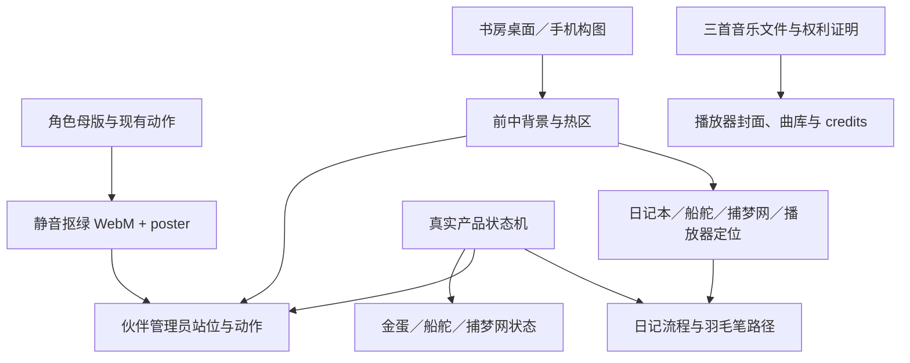

# InsightLoop V5 视觉与声音资产缺口表

**版本：** V5.0  
**状态：** 资产盘点基线  
**盘点日期：** 2026-08-03  
**仓库：** `passiongrow88/InsightLoop`  
**分支：** `v5/product-operating-system`  
**盘点提交：** `286a3a0aeaa2478ea323528454d1630db6d179c9`  
**约束：** 本表只盘点、归类和定义缺口；没有生成新图片、视频或音频，也没有修改角色造型。

---

## 1. 产品与角色边界

InsightLoop V5 是一个发生在温暖 2.5D 私人书房里的长期觉察系统：日记本左页保存用户完整原话，右页由 InsightLoop 接住当下并回应；小凤凰与小雷龙只作为日记管理员查找、引用并比较真实历史记录；船舵保存用户确认的方向、选择、行动与结果；捕梦网保存、搜索和回看梦境，不作预言或玄学定论。

永久角色关系：

- **InsightLoop：** 日记右页回应者。
- **日记本：** 左页保存用户完整原话；右页显示 InsightLoop 回应。
- **小凤凰／小雷龙：** 日记管理员和记忆向导，不是日常回应发言者。
- **船舵：** 用户确认后的方向、选择、行动和结果。
- **捕梦网：** 梦境存档、搜索和回看，不作预言。
- **书房：** 首页和主要使用环境，不是装饰背景。

---

## 2. 盘点来源与结论

### 2.1 仓库现状

| 来源 | 已发现 | 结论 |
|---|---|---|
| `public/icon.png`、`public/apple-touch-icon.png` | 两份相同的 1024×1024 InsightLoop 品牌图 | 可作为品牌参考；文件扩展名为 PNG，但实际编码为 JPEG，首发前应输出真正的 PNG/WebP favicon 派生文件。 |
| 仓库其他目录 | 未发现角色、书房、日记本、羽毛笔、船舵、捕梦网、播放器、音乐、环境音或 SFX 文件 | V5 分支目前没有可直接加载的正式 V5 资产包。 |

### 2.2 File Library／已配置资料

`/InsightLoop` 内共发现 54 项：51 张 PNG、2 个 ZIP、1 份旧版目标文档。另在根目录发现重复的无水印 ZIP 与 QC contact sheet。

可确认的内容包括：

- 小凤凰与小雷龙固定造型原图、动作姿态原图和角色参考图；
- 凤凰蛋、小雷龙蛋、蛋选择卡和破壳参考图；
- 两张旧版“Echo Study”场景概念图；
- 书架道具与一批旧 UI 元素；
- `InsightLoop_Mascot_Animation_NoWatermark_36Videos.zip`；
- 若干旧版页面截图与界面切图。

### 2.3 Google Drive：InsightLoop Mascot 动画资产 V1

| 分组 | 数量 | 内容 |
|---|---:|---|
| `Source PNG` | 51 | 小凤凰 16、小雷龙 16、两类蛋 4、旧 UI 15。 |
| `InsightLoop_Mascot_Animation_Video` | 36 | 小凤凰 16、小雷龙 16、蛋动画 4。 |
| 说明文档 | 1 | `InsightLoop｜豆包云端批量视频生成指令 V2`。 |
| 校验文件 | 1 | 无水印 ZIP SHA-256。 |

无水印 ZIP 实测 SHA-256 为：

`d14020000b992c09fb49c29e5eec3e13ec49ea2eefcb1140e99a232e3fdb6ab8`

与 Drive 校验文件一致。

### 2.4 现有视频技术状态

- 36 段均可解码；主体为 H.264 MP4、`yuv420p`、方形画布。
- 大部分为 720×720、24 fps、约 4.096 秒；`P-01` 为 480×480、30 fps；破壳片段约 5.088 秒。
- 视频没有 Alpha 透明通道，背景为绿幕；不能直接叠加到书房。
- 36 段均检测到 AAC 音轨，且多段包含明显非静音内容；这与原制作指令“无音频、无音乐、无音效”冲突。
- 绿幕亮度并不完全一致；`P-11_Phoenix_pattern-found` 抽帧出现非纯绿灰区，必须单独修复或重导出。
- 因此现有动作内容可复用，但原始 MP4 **不能直接作为上线文件**。

要求保留原角色设计的处理路径：

1. 从现有 MP4 去除音轨；
2. 绿幕抠像，输出透明 WebM；
3. 输出透明 PNG/WebP poster；
4. 不重绘脸、眼睛、比例、羽毛、角、爪、颜色、材质或身份；
5. 对循环接缝、闪烁、残绿、肢体漂移、道具变形逐条验收；
6. 原始文件只作母版保存，网页只加载通过 QC 的派生文件。

---

## 3. 尺寸与格式编码

后续表格使用以下尺寸编码，避免每行重复完整规格。

| 编码 | 桌面 | 手机 | 主要用途 |
|---|---|---|---|
| `SCENE` | 母版 3840×2160；交付 2560×1440、1920×1080 | 母版 2160×3840；交付 1440×2560、1080×1920 | 完整书房及光照背景。 |
| `LAYER` | 长边 2560 或与 2560×1440 场景同画布 | 长边 1440 或与 1440×2560 场景同画布 | 前／中／背景、光效、视差层。 |
| `BOOK` | 母版 2400×1600；交付约 1800×1200 | 母版 1200×1600；交付约 900×1200 | 打开的日记本与页面。 |
| `OBJ-L` | 1024×1024 母版；交付 512／768／1024 | 768×768 母版；交付 384／512／768 | 蛋、船舵、捕梦网、播放器等主要物件。 |
| `OBJ-S` | 512×512 母版；交付 128／256／512 | 同桌面 | 光点、墨迹、唱针、小物件。 |
| `CHAR` | 720×720 WebM + 1024×1024 母版/poster | 480×480 或 512×512 WebM + poster | 小凤凰、小雷龙状态动画。 |
| `UI` | SVG/CSS 优先；位图 2×/3× | SVG/CSS 优先；最小触控区 44×44 CSS px | 热区、焦点、按钮和状态提示。 |
| `AUDIO-SFX` | 48 kHz、24-bit 母版 WAV；交付 OGG Opus + AAC | 同桌面 | 短音效，通常 mono 或窄 stereo。 |
| `AUDIO-MUSIC` | 48 kHz、24-bit stereo 母版 WAV；交付 OGG Opus + AAC | 同桌面 | 环境声和三首书房音乐。 |

### 格式原则

- 静态场景：AVIF/WebP，PNG 仅保留母版或透明需求。
- 透明角色动画：WebM VP9/AV1 Alpha；每段提供 WebP poster。
- 小型程序化状态：CSS 动画或 Lottie；不把大量写实 2.5D 物件强行转成 Lottie。
- 日记本、船舵、捕梦网等局部动效：分层 WebP/透明 PNG + CSS；需要连续材质变化时使用透明 WebM。
- 音频：母版 WAV，网页 OGG Opus + AAC 回退；不得只提供单一浏览器格式。

---

## 4. 已存在并可复用的资产

### 4.1 角色与蛋

| 现有编号 | 已存在状态 | V5 可复用用途 | 复用限制 | 建议归档 |
|---|---|---|---|---|
| `P/T-01` | idle-breathe | 安静待机、等待用户 | 先去音轨、抠绿、输出透明 WebM；不写成 InsightLoop 发言。 | `public/assets/v5/companions/{character}/idle.*` |
| `P/T-02` | welcome | 欢迎用户回来 | 同上；仅作房间行为。 | `.../{character}/welcome.*` |
| `P/T-03` | listening | 文字深度回顾时倾听 | 不用于普通日记右页回应。 | `.../{character}/deep-review-text.*` |
| `P/T-04` | voice-listening | 语音深度回顾时倾听 | 不得冒充自定义语音；原音轨必须移除。 | `.../{character}/deep-review-voice.*` |
| `P/T-05` | writing | 整理日记、登记档案 | 可作为管理员动作；不得让角色代写右页回应。 | `.../{character}/organise-journal.*` |
| `P/T-06` | thinking | 查找或比较前的准备状态 | 只表达检索中，不暗示读心。 | `.../{character}/search-thinking.*` |
| `P/T-07` | gentle-question | 深度回顾内的一个温和追问 | 不用于每篇日记的标准 InsightLoop 提问。 | `.../{character}/deep-review-question.*` |
| `P/T-08` | review-today | 看书、回看已保存记录 | 可覆盖“看书”基础状态。 | `.../{character}/reading.*` |
| `P/T-09` | browse-archive | 翻找档案、靠近书架检索 | 可覆盖“翻找书籍”；是否真正包含走向书架须在最终视频 QC 确认。 | `.../{character}/browse-archive.*` |
| `P/T-10` | memory-found | 找到记录 | 必须在真实检索成功后触发。 | `.../{character}/record-found.*` |
| `P/T-11` | pattern-found | 比较结果或有证据的重复结构 | 只可在至少两条不同日期且结构相似的记录验证后触发；凤凰版本需修复灰区。 | `.../{character}/evidence-connection.*` |
| `P/T-12` | soft-sigh | 没找到或证据不足后的温和反应 | 必须配合“没有找到／证据不足”的真实文字状态，不能伪装成结果。 | `.../{character}/no-result.*` |
| `P/T-13` | comfort | 靠近日记本、安静陪伴 | 不得成为日常回应发言者。 | `.../{character}/quiet-nearby.*` |
| `P/T-14` | quiet-celebrate | 七日回顾准备完成、保存后的克制确认 | 不是奖励爆炸或游戏庆祝。 | `.../{character}/review-ready.*` |
| `P/T-15` | save-complete | 整理完成／保存完成后的管理员确认 | 只在后端真实保存成功后触发。 | `.../{character}/archive-saved.*` |
| `P/T-16` | resting | 免费额度暂不可用时继续休息 | 可覆盖自然休息；不显示冷冰冰的锁。 | `.../{character}/resting.*` |
| `E-01/E-03` | 两颗内蛋 idle | 金蛋打开后出现的凤凰蛋／小雷龙蛋 | 不是书房中的金色外蛋。 | `public/assets/v5/incubation/inner-eggs/{character}-idle.*` |
| `E-02/E-04` | 两颗内蛋 hatch | 破壳动画 | 需先做角色一致性、残绿、音轨和首尾验收。 | `.../inner-eggs/{character}-hatch.*` |

### 4.2 可作为局部素材或参考的现有资产

| 资产 | 处理结论 |
|---|---|
| `C-01/C-02_UI_egg-choice-card.png` | 可从现有透明卡片衍生两颗内蛋选择图；必须重新放入 V5 的书房／仪式构图，不沿用旧式功能卡布局。 |
| `C-12_UI_memory-shelf.png` / `Cozy Indigo Memory Shelf.png` | 可作为书架局部道具或风格参考；需匹配最终书房视角、光向和比例。 |
| 小凤凰／小雷龙 1254×1254 角色参考 PNG | 固定角色造型母版；不得改造型、比例、颜色或材质。 |
| `Quiet Echo Study with Eight Niches.png`、`Warm Ivory Echo Study.png` | 仅作光色和材质参考；画面是展示厅/空台，不含 V5 必需的书桌、日记本、船舵、捕梦网、播放器和空间层，不能作为最终书房。 |
| `C-03` 至 `C-11`、`C-14` | 旧紫蓝扁平 UI／旧机制视觉，仅可作历史参考；不作为 V5 温暖 2.5D 书房正式资产。 |
| `C-15_UI_resource-lock.png` | 禁止使用；与 V5“不可用时自然睡觉或看书、不得用冷锁”为主的规则冲突。 |
| 旧版截图、`image*.png` | 只作旧版证据，不可反推 V5 UI。 |

---

## 5. 缺失资产总表

说明：

- **来源：** `衍生`＝从现有角色/蛋/道具素材处理，不改变角色设计；`新制`＝必须新制作；`程序`＝CSS/Lottie/运行时效果。
- **首发：** `是`＝第一批最小可上线资产包必须具备；`否`＝后续阶段。

### A. 书房主场景

| ID | 缺失资产与用途 | 来源 | 建议格式 | 尺寸 | 首发 | 优先级 | 依赖 | 验收标准 | 建议文件名／目录 |
|---|---|---|---|---|---|---|---|---|---|
| ST-01 | 桌面 2.5D 温暖书房完整构图，承载所有核心物件 | 新制 | 分层 WebP/AVIF + PNG 母版 | SCENE | 是 | P0 | 产品物件位置图 | 固定视角；日记本为视觉中心；五个 P0 物件可辨认、可点击；不是展示厅、卡片墙或仪表盘 | `public/assets/v5/study/desktop/study-base.webp` |
| ST-02 | 手机端重新构图，不是桌面裁切 | 新制 | 分层 WebP/AVIF | SCENE | 是 | P0 | ST-01 视觉设定 | 360×640 至 430×932 CSS viewport 无横滚；所有核心物件可达；日记本仍为中心 | `.../study/mobile/study-base.webp` |
| ST-03 | 白天／窗光状态 | 新制 | WebP + CSS opacity | LAYER | 否 | P2 | ST-01/02 | 不改变物件位置；光向一致；文字对比达标 | `.../lighting/day-window.webp` |
| ST-04 | 夜晚／暖灯状态 | 新制 | WebP + CSS opacity | LAYER | 是 | P0 | ST-01/02 | 首发默认暖而不暗；可读区域不被高光覆盖 | `.../lighting/night-warm.webp` |
| ST-05 | 背景层：墙、窗外、远景 | 新制 | WebP/AVIF | LAYER | 是 | P0 | ST-01/02 | 可独立位移；无交互物件烘焙进去 | `.../layers/background.webp` |
| ST-06 | 中景层：书架、墙上船舵、捕梦网、播放器位置 | 新制；书架可参考现有 C-12 | 透明 WebP/PNG | LAYER | 是 | P0 | ST-01 | 热区物件不与背景合并；遮挡关系正确 | `.../layers/midground.webp` |
| ST-07 | 前景层：书桌、桌沿、近景装饰 | 新制 | 透明 WebP/PNG | LAYER | 是 | P0 | ST-01 | 可遮挡角色脚部并形成深度；不挡核心控件 | `.../layers/foreground.webp` |
| ST-08 | 轻微视差图层配置 | 程序 | CSS transform/JSON 配置 | SCENE | 是 | P0 | ST-05~07 | 指针/陀螺仪移动克制；减少动态时完全停用 | `src/config/v5/study-layers.ts` |
| ST-09 | 未登录、未点亮的示范书房 | 新制/程序 | 分层 WebP + CSS | SCENE | 是 | P0 | ST-01/02 | 不是登录墙；仍可打开日记；未解锁物件以房间语义回应 | `.../states/guest.*` |
| ST-10 | 登录后的个人书房 | 新制/程序 | WebP + 用户状态层 | SCENE | 是 | P0 | ST-01/02 | 能显示蛋/伙伴/船舵/捕梦网真实状态；不伪造功能 | `.../states/member.*` |
| ST-11 | 环境光、窗光、灯火/壁炉动态层 | 新制/程序 | 透明 WebM 或 CSS | LAYER | 是 | P0 | ST-04 | 可循环；无明显接缝；低功耗降级为静态图 | `.../lighting/ambient-loop.webm` |
| ST-12 | 每个可点击物件的 hover/press/focus 高亮 | 程序 | CSS + 透明 WebP mask | UI | 是 | P0 | 最终物件轮廓 | 不只靠颜色；键盘焦点可见；触控按下有反馈 | `.../hotspots/{object}-{state}.*` |

### B. 日记本

| ID | 缺失资产与用途 | 来源 | 格式 | 尺寸 | 首发 | 优先级 | 依赖 | 验收标准 | 文件名／目录 |
|---|---|---|---|---|---|---|---|---|---|
| JR-01 | 书架上的关闭状态 | 新制 | WebP + 透明 PNG | OBJ-L | 是 | P0 | 最终书房视角 | 与书架透视、光向一致；可清楚辨识为主入口 | `public/assets/v5/journal/room/journal-closed.webp` |
| JR-02 | 从书架飞向桌面的过渡 | 新制 | WebM 或分层 CSS keyframes | BOOK | 是 | P0 | JR-01、桌面位置 | 无跳帧穿模；2 秒内完成；减少动态为淡入 | `.../transitions/journal-to-desk.webm` |
| JR-03 | 落桌动画 | 新制 | WebM/CSS | BOOK | 是 | P0 | JR-02 | 有重量感、无夸张弹跳；声音可关闭 | `.../transitions/journal-land.webm` |
| JR-04 | 打开动画 | 新制 | WebM 或帧序列 WebP | BOOK | 是 | P0 | JR-03 | 打开后准确落到可输入版式；可跳过 | `.../transitions/journal-open.webm` |
| JR-05 | 翻页动画 | 新制 | WebM/CSS 3D | BOOK | 是 | P0 | 页面模板 | 不遮挡焦点；长内容分页后页序正确 | `.../transitions/page-turn.webm` |
| JR-06 | 关闭并返回书房 | 新制 | WebM/CSS | BOOK | 是 | P0 | JR-04 | 保存失败时不得播放成功关闭；减少动态可用 | `.../transitions/journal-close.webm` |
| JR-07 | 泛黄左页模板：用户完整原话 | 新制 | WebP 纹理 + CSS 排版 | BOOK | 是 | P0 | 字体规范 | 原话可选取；不烘焙文字；短中文不出现难看断行 | `.../pages/page-left-original.webp` |
| JR-08 | 泛黄右页模板：InsightLoop 回应 | 新制 | WebP 纹理 + CSS 排版 | BOOK | 是 | P0 | JR-07 | 与左页有细微识别差异；不显示伙伴头像气泡 | `.../pages/page-right-insightloop.webp` |
| JR-09 | 短内容版式 | 程序 | CSS | BOOK | 是 | P0 | JR-07/08 | 少量文字不悬空、不被过度放大 | `src/styles/v5/journal-short.css` |
| JR-10 | 长内容版式 | 程序 | CSS | BOOK | 是 | P0 | JR-07/08 | 可滚动/分页；200% zoom 可用；不裁字 | `.../journal-long.css` |
| JR-11 | 多页内容版式 | 程序 | CSS + page model | BOOK | 是 | P0 | JR-05/10 | 页码、顺序和原文保持一致；重开不漂移 | `.../journal-pagination.css` |
| JR-12 | 梦境选填页 | 新制/程序 | WebP 纹理 + CSS | BOOK | 是 | P0 | JR-07 | 可跳过；保存后与原条目关联 | `.../pages/page-dream.webp` |
| JR-13 | 感谢选填页 | 新制/程序 | WebP 纹理 + CSS | BOOK | 是 | P0 | JR-07 | 不限对象为人；可跳过无负面状态 | `.../pages/page-thanks.webp` |
| JR-14 | 道歉选填页 | 新制/程序 | WebP 纹理 + CSS | BOOK | 是 | P0 | JR-07 | 不限对象为人；不羞辱用户 | `.../pages/page-apology.webp` |
| JR-15 | 修改状态 | 程序 | CSS + 局部墨迹退场 | BOOK | 是 | P0 | 数据状态机 | 修改不覆盖已确认版本；按钮有 focus/press 状态 | `.../states/editing.*` |
| JR-16 | 确认状态 | 程序 | CSS | BOOK | 是 | P0 | review 数据状态 | 明确显示完整原话；确认前不写入左页 | `.../states/review-confirm.*` |
| JR-17 | 保存中状态 | 程序 | CSS/Lottie 小动效 | UI | 是 | P0 | 后端保存状态 | 不提前显示“已保存”；输入仍可恢复 | `.../states/saving.json` |
| JR-18 | 历史证据书签 | 新制 | 透明 PNG/WebP + CSS | OBJ-S | 是 | P0 | 真实证据数据 | 含日期入口；展开后有原话和关联理由；无证据不出现 | `.../evidence/bookmark.webp` |
| JR-19 | 历史证据夹页／折叠纸条 | 新制 | WebP + CSS | BOOK | 是 | P0 | JR-18 | 不挤占主回应；可展开/收起；键盘可操作 | `.../evidence/folded-note.webp` |
| JR-20 | 墨水书写与文字渐显 | 程序 | CSS mask/canvas | BOOK | 是 | P0 | 字体、羽毛笔轨迹 | 真文本驱动；可选取；长文可加速；减少动态即时出现 | `src/animations/v5/ink-reveal.ts` |
| JR-21 | 跳过动画状态 | 程序 | CSS/状态机 | UI | 是 | P0 | JR-02~06、JR-20 | 跳过只结束动效，不取消保存或生成 | `src/components/v5/SkipAnimationControl.tsx` |
| JR-22 | 保存完成状态 | 新制/程序 | CSS + 轻微印记/页角状态 | BOOK | 是 | P0 | 后端已持久化 | 仅在真实保存成功后显示；重试不产生重复条目 | `.../states/saved.*` |

### C. 羽毛笔

| ID | 缺失资产与用途 | 来源 | 格式 | 尺寸 | 首发 | 优先级 | 依赖 | 验收标准 | 文件名／目录 |
|---|---|---|---|---|---|---|---|---|---|
| QL-01 | 2.5D 羽毛笔母版与静止悬浮 | 新制；不可直接用扁平 `C-03` | 透明 PNG/WebP + CSS | OBJ-L | 是 | P0 | 书房材质规范 | 光向、材质、比例与日记本一致；无紫色旧 UI 感 | `public/assets/v5/quill/quill-master.webp` |
| QL-02 | 等待用户 | 程序 | CSS 浮动 | OBJ-L | 是 | P0 | QL-01 | 幅度克制；减少动态时静止 | `.../quill-wait.css` |
| QL-03 | 开始书写 | 新制/程序 | 透明 WebM/CSS | OBJ-L | 是 | P0 | QL-01、页面坐标 | 笔尖准确落到首字位置 | `.../quill-start.webm` |
| QL-04 | 连续书写 | 程序 | CSS/canvas path | OBJ-L | 是 | P0 | JR-20 | 跟随真实文字进度；无明显穿字 | `src/animations/v5/quill-writing.ts` |
| QL-05 | 长文加速完成 | 程序 | 状态机/CSS | OBJ-L | 是 | P0 | QL-04 | 开头有人类速度，随后加速；等待不过长 | `.../quill-accelerate.ts` |
| QL-06 | 停顿思考 | 程序 | CSS | OBJ-L | 是 | P0 | AI pending 状态 | 只表示等待，不伪造 InsightLoop 已完成 | `.../quill-pause.css` |
| QL-07 | 修改／擦除／重新书写 | 新制/程序 | CSS + 墨迹 mask | OBJ-L | 是 | P0 | JR-15 | 不销毁原文历史；擦除仅为视觉 | `.../quill-rewrite.*` |
| QL-08 | 写完落下 | 新制/程序 | WebM/CSS | OBJ-L | 是 | P0 | QL-04 | 仅在文字完整显示后发生 | `.../quill-finish.webm` |
| QL-09 | 左页书写动作 | 程序 | 路径配置 | BOOK | 是 | P0 | JR-07、QL-04 | 在左页真实原话区域内移动 | `.../paths/left-page.json` |
| QL-10 | 右页书写动作 | 程序 | 路径配置 | BOOK | 是 | P0 | JR-08、QL-04 | 只写 InsightLoop 回应，不挂伙伴身份 | `.../paths/right-page.json` |
| QL-11 | 墨迹、笔尖接触与纸张压感 | 新制/程序 | 透明 WebP/CSS | OBJ-S | 是 | P0 | QL-01、JR-20 | 无墨水溅射；低对比、自然；可关闭声音 | `.../effects/nib-contact.webp` |

### D. 陪伴兽缺失状态

以下状态未被现有 P/T-01 至 P/T-16 清楚、完整覆盖；现有覆盖项已经列在第 4.1 节，不重复制作。

| ID | 缺失状态与用途 | 来源 | 格式 | 尺寸 | 首发 | 优先级 | 依赖 | 验收标准 | 文件名／目录 |
|---|---|---|---|---|---|---|---|---|---|
| CP-01 | 金色外蛋旁等待 | 现有角色造型衍生 | 透明 WebM + poster | CHAR | 是 | P0 | GE-01、角色母版 | 角色不碰撞蛋；不说话；造型完全一致 | `public/assets/v5/companions/{character}/wait-by-golden-egg.*` |
| CP-02 | 明确睡觉状态 | 现有角色造型衍生 | 透明 WebM + poster | CHAR | 否 | P1 | 角色母版 | 与 `resting` 区分；不夸张打鼾；可循环 | `.../{character}/sleeping.*` |
| CP-03 | 整理多本日记 | 现有角色造型衍生，可参考 P/T-05、P/T-15 | 透明 WebM | CHAR | 是 | P0 | 书架/日记尺寸 | 明确是管理员动作；不代写右页回应 | `.../{character}/organise-journals.*` |
| CP-04 | 走向书架 | 现有角色造型衍生 | 透明 WebM | CHAR | 否 | P1 | 房间站位、P/T-09 | 固定 A→B 站位；不要求自由漫游；脚/翅不漂移 | `.../{character}/walk-to-shelf.*` |
| CP-05 | 抱着日记回来 | 现有角色造型衍生，可参考 P/T-10 | 透明 WebM | CHAR | 否 | P1 | CP-04、书本 prop | 回到固定位置；书本透视一致 | `.../{character}/return-with-journal.*` |
| CP-06 | 比较多本日记 | 现有角色造型衍生，可参考 P/T-11 | 透明 WebM | CHAR | 否 | P1 | 至少两条真实证据 | 画面有多本/多页真实档案语义；不作命运连线 | `.../{character}/compare-journals.*` |
| CP-07 | 抬头看捕梦网 | 现有角色造型衍生 | 透明 WebM | CHAR | 否 | P1 | 捕梦网坐标 | 视线与物件位置吻合；不作神秘预言表情 | `.../{character}/look-dreamcatcher.*` |
| CP-08 | 靠近日记本但不发言 | 现有角色造型衍生，可参考 P/T-13 | 透明 WebM | CHAR | 是 | P0 | 日记本桌面坐标 | 只作安静陪伴；右页仍署名 InsightLoop | `.../{character}/quiet-near-journal.*` |

### E. 金蛋与孵化

| ID | 缺失资产与用途 | 来源 | 格式 | 尺寸 | 首发 | 优先级 | 依赖 | 验收标准 | 文件名／目录 |
|---|---|---|---|---|---|---|---|---|---|
| GE-01 | 书房中的金色外蛋 | 新制 | 透明 WebP/PNG | OBJ-L | 是 | P0 | 书房光向 | 与内蛋明确不同；从首次进入即存在 | `public/assets/v5/incubation/golden-egg/base.webp` |
| GE-02 | 轻微呼吸与发光 | 程序/新制 | CSS + glow WebP | OBJ-L | 是 | P0 | GE-01 | 安静循环；无奖励爆闪；减少动态可静态 | `.../golden-egg/idle-glow.*` |
| GE-03 | 第 1 至第 7 个有效记录日成长状态 | 新制/程序 | 7 张 WebP + CSS | OBJ-L | 是 | P0 | 服务端 distinct-day 真值 | 同一天多篇只升一级；不靠本地存储伪造 | `.../golden-egg/day-{1..7}.webp` |
| GE-04 | 裂纹逐渐增加 | 新制 | 透明 WebP overlay | OBJ-L | 是 | P0 | GE-03 | 裂纹 1→7 可辨认但不恐怖；层间无跳变 | `.../golden-egg/crack-{1..7}.webp` |
| GE-05 | 金蛋打开，出现凤凰蛋和小雷龙蛋 | 新制 + 现有 E-01/E-03 衍生 | WebM + posters | OBJ-L | 否 | P1 | GE-04、内蛋素材 | 外蛋与两颗内蛋转换连贯；角色设计不变 | `.../ceremony/golden-egg-open.webm` |
| GE-06 | 系统推荐某一颗蛋的光效 | 程序 | CSS glow | OBJ-L | 否 | P1 | 推荐结果 | 仅“推荐”，不锁定；不使用诊断文案 | `.../selection/recommended.css` |
| GE-07 | 用户切换选择 | 程序 | CSS/Lottie | OBJ-L | 否 | P1 | C-01/C-02 派生 | 两颗均可选；推荐不阻止切换 | `.../selection/switch.*` |
| GE-08 | 命名仪式 | 新制/程序 | 书房内 overlay + CSS | BOOK/UI | 否 | P1 | GE-07 | 不离开书房世界；支持键盘/手机输入 | `.../ceremony/naming.*` |
| GE-09 | 破壳动画 | 复用并处理 E-02/E-04 | 透明 WebM + poster | CHAR | 否 | P1 | GE-08 | 无残绿、无多肢、无变脸、无音轨；角色一致 | `.../inner-eggs/{character}-hatch.webm` |
| GE-10 | 出生欢迎动画 | 复用 P/T-02 + 新制衔接 | 透明 WebM | CHAR | 否 | P1 | GE-09 | 破壳后角色尺寸与正常状态一致 | `.../ceremony/{character}-birth-welcome.webm` |
| GE-11 | Pro 首篇后的加速孵化流程 | 程序 | 状态机 + 既有资产 | — | 否 | P1 | 首篇真实保存、付费权益 | 付款不跳过推荐、选择、命名、破壳、欢迎 | `src/flows/v5/pro-hatching.ts` |
| GE-12 | 免费用户七个不同记录日的完整流程 | 程序 | 状态机 + 既有资产 | — | 否 | P1 | GE-03~10 | 非连续可计；同日不重复；服务端可验证 | `src/flows/v5/free-hatching.ts` |

### F. 船舵

| ID | 缺失资产与用途 | 来源 | 格式 | 尺寸 | 首发 | 优先级 | 依赖 | 验收标准 | 文件名／目录 |
|---|---|---|---|---|---|---|---|---|---|
| WH-01 | 墙上普通摆件／无方向安静状态 | 新制 | WebP + 透明 PNG | OBJ-L | 是 | P0 | 书房视角 | 未激活仍在房间；不是灰锁或任务卡 | `public/assets/v5/wheel/wheel-dormant.webp` |
| WH-02 | 潜在线索轻微发光 | 程序 | CSS glow | OBJ-L | 是 | P0 | InsightLoop 方向候选 | 只提示候选；不自动建方向 | `.../wheel-candidate.css` |
| WH-03 | 等待用户确认 | 新制/程序 | WebP + CSS | OBJ-L | 是 | P0 | WH-02 | 有接受、编辑、拒绝、稍后；触控/键盘可用 | `.../wheel-await-confirm.*` |
| WH-04 | 用户接受后的解锁／活动状态 | 新制/程序 | WebP + CSS | OBJ-L | 是 | P0 | 明确确认 | 存储用户原话与建议原话分离 | `.../wheel-active.*` |
| WH-05 | 方向进行中 | 新制/程序 | CSS 指针状态 | OBJ-L | 否 | P1 | 活动方向 | 不变成任务看板；显示一个当前方向焦点 | `.../wheel-in-progress.*` |
| WH-06 | 有新行动需要记录 | 程序 | 小光点/纸签 | OBJ-S | 否 | P1 | 行动候选 | 需用户确认关联 | `.../wheel-action-prompt.*` |
| WH-07 | 等待结果回访 | 程序 | CSS | OBJ-L | 否 | P1 | follow-up date | 不制造紧迫惩罚 | `.../wheel-await-outcome.*` |
| WH-08 | 完成／调整／放弃方向 | 新制/程序 | 3 个克制状态 | OBJ-L | 否 | P1 | 用户选择 | 放弃不是失败羞辱；历史仍可回看 | `.../wheel-{complete|adjust|release}.*` |
| WH-09 | 船舵转动与方向指针 | 程序 | CSS transform/Lottie | OBJ-L | 是 | P0 | WH-01 | 转动克制、可降级；真实状态驱动 | `.../wheel-motion.*` |

### G. 捕梦网

| ID | 缺失资产与用途 | 来源 | 格式 | 尺寸 | 首发 | 优先级 | 依赖 | 验收标准 | 文件名／目录 |
|---|---|---|---|---|---|---|---|---|---|
| DR-01 | 普通静止状态 | 新制 | WebP/透明 PNG | OBJ-L | 是 | P0 | 书房视角 | 清楚可辨但不抢日记本中心 | `public/assets/v5/dreamcatcher/dreamcatcher-idle.webp` |
| DR-02 | 梦境保存后亮起 | 程序/新制 | CSS glow/透明 WebM | OBJ-L | 是 | P0 | 保存成功真值 | 仅保存成功后触发；失败不亮 | `.../dreamcatcher-saved.*` |
| DR-03 | 新梦境光点进入 | 新制/程序 | Lottie/CSS | OBJ-S | 是 | P0 | DR-02 | 安静、短暂；不是积分奖励 | `.../new-dream-node.*` |
| DR-04 | 多个梦境形成结点 | 程序 | SVG/CSS | OBJ-L | 否 | P1 | 真实梦境记录 | 节点数来自真实记录；不暗示命运网络 | `.../dream-nodes.*` |
| DR-05 | 可点击/hover/focus 状态 | 程序 | CSS | UI | 是 | P0 | DR-01 | 不只靠颜色；键盘可打开档案 | `.../dreamcatcher-interactive.css` |
| DR-06 | 梦境档案打开过渡 | 新制/程序 | WebM/CSS | BOOK | 是 | P0 | 梦境 archive UI | 保持书房连续感；可减少动态 | `.../dream-archive-open.*` |
| DR-07 | 重复人物／地点／情绪／象征提示 | 程序 | 纸签/柔光节点 | OBJ-S | 否 | P1 | 至少两条真实梦境 | 使用不确定语言；无预言、算命、诊断或恐怖视觉 | `.../repeat-element-hint.*` |

### H. 老式播放器

| ID | 缺失资产与用途 | 来源 | 格式 | 尺寸 | 首发 | 优先级 | 依赖 | 验收标准 | 文件名／目录 |
|---|---|---|---|---|---|---|---|---|---|
| MU-01 | 书房中的关闭状态 | 新制 | WebP/透明 PNG | OBJ-L | 是 | P0 | 书房视角 | 可辨识、可点击、不抢主中心 | `public/assets/v5/player/player-off.webp` |
| MU-02 | 打开播放器界面 | 新制/程序 | 分层 WebP + CSS | OBJ-L/UI | 是 | P0 | MU-01 | 仍属书房物件，不展开成主音乐平台 | `.../player-open.*` |
| MU-03 | 三首自有 AI 音乐唱片封面 | 新制；不生成前先取得曲目资料 | WebP 1000×1000 | OBJ-L | 是 | P0 | 三首音频与授权资料 | 每首封面、标题、来源准确对应；不得先做空壳假曲目 | `.../covers/track-{01..03}.webp` |
| MU-04 | 播放／暂停／上首／下首 | 程序 | SVG/CSS | UI | 是 | P0 | 音频文件 | 全部可键盘操作；状态与真实播放同步 | `.../controls/*` |
| MU-05 | 单曲循环 | 程序 | SVG/CSS | UI | 是 | P0 | MU-04 | 只循环当前曲；状态清楚 | `.../controls/loop-one.*` |
| MU-06 | 音量调整／静音 | 程序 | CSS/HTML control | UI | 是 | P0 | 音频引擎 | 默认不突然大声；偏好可保存 | `.../controls/volume.*` |
| MU-07 | 黑胶转动与唱针落下 | 新制/程序 | CSS + 透明 WebP | OBJ-L | 是 | P0 | MU-02、真实播放状态 | 暂停即停；减少动态可静态；唱针动作和音频同步 | `.../vinyl-motion.*` |
| MU-08 | 本地 MP3 选择状态 | 程序 | CSS/HTML file picker | UI | 否 | P1 | 浏览器 File API | 文件不上传、不宣称跨设备同步 | `.../local-file-state.*` |
| MU-09 | 无本地音乐时默认三首书房音乐 | 程序 | 状态机 | — | 是 | P0 | MU-03、三首音频 | 三首音频存在且授权通过后才显示 | `src/config/v5/default-tracks.ts` |
| MU-10 | 授权与出处信息页面 | 程序 | 纸张式 panel/CSS | BOOK/UI | 是 | P0 | 授权登记 | 标题、作者/生成平台、计划、日期、用途和限制可核查 | `src/components/v5/MusicCredits.tsx` |
| MU-11 | 加载失败状态 | 程序 | CSS | UI | 是 | P0 | 音频错误分类 | 不静默；可重试；不会阻断写日记 | `.../player-load-error.*` |
| MU-12 | 版权不可用状态 | 程序 | CSS + 文案 | UI | 是 | P0 | 权利状态 | 下架对应曲目且说明；不使用未授权替代链接 | `.../player-rights-unavailable.*` |

**当前阻塞：** 未在仓库、Library 或指定 Drive 文件夹找到三首自有音乐文件、曲名、生成平台、使用计划、生成日期和商业 App 内完整播放授权证据。`V5-OPEN-001` 未解决前，MU-03、MU-09 和正式音乐发布状态为 `BLOCKED`，不得用占位音频冒充完成。

### I. 电子听书

| ID | 缺失资产与用途 | 来源 | 格式 | 尺寸 | 首发 | 优先级 | 依赖 | 验收标准 | 文件名／目录 |
|---|---|---|---|---|---|---|---|---|---|
| AB-01 | 书房中的听书设备／独立书架入口 | 新制 | WebP/透明 PNG | OBJ-L | 否 | P2 | 核心稳定后 | 可先不出现；未实现时不得假装能打开目录 | `public/assets/v5/audiobooks/audiobook-object.webp` |
| AB-02 | 未开放状态 | 程序 | CSS/文案 | UI | 否 | P2 | AB-01 | 明确“尚未开放”，不是付费锁诱导 | `.../audiobook-coming-soon.*` |
| AB-03 | 免费公开版权听书列表 | 程序 | 书架/纸页 UI | BOOK | 否 | P2 | 合法来源、地区核验 | 只列真实可用作品 | `src/components/v5/PublicDomainAudiobooks.tsx` |
| AB-04 | 播放／暂停／进度／继续收听 | 程序 | HTML audio + CSS | UI | 否 | P2 | AB-03 | 进度持久化；无虚假播放 | `.../AudiobookPlayer.tsx` |
| AB-05 | 作品封面模板 | 新制 | WebP 1000×1500 | OBJ-L | 否 | P2 | 公版作品元数据 | 不伪造官方封面；来源可追溯 | `.../covers/{work-id}.webp` |
| AB-06 | 作者／朗读者／版权／来源信息 | 程序 | 纸页 UI | BOOK | 否 | P2 | 授权/公版元数据 | 四项完整可见 | `.../AudiobookCredits.tsx` |
| AB-07 | Affiliate 推荐跳转状态 | 程序 | CSS | UI | 否 | P2 | 合作平台条款 | 明确披露 affiliate；不冒充平台播放器 | `.../affiliate-link-state.*` |

### J. 声音资产

当前仓库、Library 与指定 Drive 文件夹均未发现独立 MP3/WAV/OGG/M4A 音乐或音效文件。现有角色 MP4 内的 AAC 音轨不符合原制作规范，不能当作正式声音资产复用。

| ID | 缺失声音 | 来源 | 格式 | 首发 | 优先级 | 依赖 | 验收标准 | 文件名／目录 |
|---|---|---|---|---|---|---|---|---|
| AU-01 | 温暖书房环境声 | 新制/合法授权 | AUDIO-MUSIC | 是 | P0 | 授权登记 | -24 至 -20 LUFS 左右的克制背景；无突发峰值；可关闭 | `public/assets/v5/audio/ambience/study-warm.{ogg,m4a}` |
| AU-02 | 羽毛笔沙沙书写 ASMR | 新制/合法授权 | AUDIO-SFX | 是 | P0 | QL-04 | 可循环/拼接；无刺耳高频；与写字速度同步 | `.../sfx/quill-writing.{ogg,m4a}` |
| AU-03 | 翻页声 | 新制/合法授权 | AUDIO-SFX | 是 | P0 | JR-05 | 短、柔和；快速翻页不叠加爆音 | `.../sfx/page-turn-{01..03}.{ogg,m4a}` |
| AU-04 | 书从书架飞出 | 新制/合法授权 | AUDIO-SFX | 是 | P0 | JR-02 | 不像魔法爆炸；音量低于主要交互 | `.../sfx/book-fly.{ogg,m4a}` |
| AU-05 | 书落桌 | 新制/合法授权 | AUDIO-SFX | 是 | P0 | JR-03 | 有重量但不惊吓；峰值受限 | `.../sfx/book-land.{ogg,m4a}` |
| AU-06 | 墨水落笔声 | 新制/合法授权 | AUDIO-SFX | 是 | P0 | QL-03/11 | 与笔尖接触同步；不重复刺耳 | `.../sfx/ink-nib-contact.{ogg,m4a}` |
| AU-07 | 捕梦网轻响 | 新制/合法授权 | AUDIO-SFX | 是 | P0 | DR-02 | 温和、非恐怖风铃；只在保存成功后播放 | `.../sfx/dreamcatcher-chime.{ogg,m4a}` |
| AU-08 | 金蛋发光声 | 新制/合法授权 | AUDIO-SFX | 是 | P0 | GE-02 | 极轻；不可像抽卡奖励 | `.../sfx/golden-egg-glow.{ogg,m4a}` |
| AU-09 | 裂蛋声 | 新制/合法授权 | AUDIO-SFX | 否 | P1 | GE-04/09 | 无惊吓、爆炸或湿黏感 | `.../sfx/egg-crack.{ogg,m4a}` |
| AU-10 | 孵化欢迎声 | 新制/合法授权 | AUDIO-SFX | 否 | P1 | GE-10 | 温暖克制；不似游戏升级 | `.../sfx/hatch-welcome.{ogg,m4a}` |
| AU-11 | 船舵轻微转动 | 新制/合法授权 | AUDIO-SFX | 是 | P0 | WH-09 | 木质轻响；不连续吱嘎 | `.../sfx/wheel-turn.{ogg,m4a}` |
| AU-12 | 唱针落下 | 新制/合法授权 | AUDIO-SFX | 是 | P0 | MU-07 | 与唱针动作同步；无高峰点击 | `.../sfx/needle-drop.{ogg,m4a}` |
| AU-13 | 黑胶底噪 | 新制/合法授权 | AUDIO-MUSIC | 是 | P0 | MU-07 | 只在播放时极低音量出现；可关闭 | `.../ambience/vinyl-noise.{ogg,m4a}` |
| AU-14 | 伙伴翻书 | 新制/合法授权 | AUDIO-SFX | 是 | P0 | P/T-08/09 | 与动作同步；可共享角色，不需各做一份 | `.../sfx/companion-page-rustle.{ogg,m4a}` |
| AU-15 | 伙伴走动 | 新制/合法授权 | AUDIO-SFX | 否 | P1 | CP-04/05 | 按材质轻响；不喧宾夺主 | `.../sfx/companion-steps.{ogg,m4a}` |
| AU-16 | 伙伴睡觉／呼吸 | 新制/合法授权 | AUDIO-SFX | 否 | P1 | CP-02 | 默认极轻或不播放；不得循环打扰 | `.../sfx/companion-sleep.{ogg,m4a}` |

全局声音验收：首次访问不自动大声播放；所有声音均有 mute/volume；记住用户偏好；同时播放数量受控；角色动画原始 AAC 音轨全部移除。

### K. 界面辅助资产与规范

| ID | 缺失资产／规范 | 来源 | 格式 | 尺寸 | 首发 | 优先级 | 依赖 | 验收标准 | 文件名／目录 |
|---|---|---|---|---|---|---|---|---|---|
| UI-01 | 点击热区提示 | 程序 | CSS + mask | UI | 是 | P0 | ST-12 | 一句短提示即可识别日记；不覆盖场景 | `src/styles/v5/hotspots.css` |
| UI-02 | hover、press、键盘 focus 状态 | 程序 | CSS | UI | 是 | P0 | 所有交互物件 | focus 可见；不只靠颜色；最小触控 44×44 | `.../interaction-states.css` |
| UI-03 | 全局加载状态 | 程序 | CSS/Lottie | UI | 是 | P0 | 各状态机 | 明确正在加载什么；不伪造完成 | `src/components/v5/LoadingState.tsx` |
| UI-04 | 网络失败状态 | 程序 | CSS + 文案 | UI | 是 | P0 | 错误分类 | 草稿保留；提供重试；不只显示“再试一次” | `.../NetworkErrorState.tsx` |
| UI-05 | 音频失败状态 | 程序 | CSS + 文案 | UI | 是 | P0 | player/error taxonomy | 区分文件、解码、网络、版权不可用 | `.../AudioErrorState.tsx` |
| UI-06 | 麦克风权限状态 | 程序 | SVG/CSS + 文案 | UI | 是 | P0 | permission API | 区分拒绝、无设备、占用、格式、服务失败 | `.../MicrophoneState.tsx` |
| UI-07 | 注册保存中状态 | 程序 | CSS | UI | 是 | P0 | auth handoff | 草稿持续可见/可恢复；不离开书房语境 | `.../RegistrationSavingState.tsx` |
| UI-08 | 未注册内容暂存状态 | 程序 | CSS | UI | 是 | P0 | local draft store | 明确“暂存在本机”；刷新可恢复；不冒充云端已保存 | `.../LocalDraftState.tsx` |
| UI-09 | 桌面安全区域规范 | 新制/文档 | Figma/JSON/CSS tokens | SCENE | 是 | P0 | ST-01 | 16:9、125%/200% zoom 下核心物件和控件不裁切 | `docs/v5/assets/layout-safe-area-desktop.md` |
| UI-10 | 手机安全区域规范 | 新制/文档 | Figma/JSON/CSS tokens | SCENE | 是 | P0 | ST-02 | 刘海、地址栏、底部手势区不挡控件 | `.../layout-safe-area-mobile.md` |
| UI-11 | 字体规范 | 新制/文档 | CSS tokens | — | 是 | P0 | 字体授权 | 中英文字体授权清楚；原文可读；短中文不碎行 | `src/styles/v5/typography.css` |
| UI-12 | 纸张规范 | 新制/文档 | WebP 纹理 + tokens | BOOK | 是 | P0 | JR-07/08 | 泛黄但对比足够；无明显重复纹理 | `public/assets/v5/tokens/paper-texture.webp` |
| UI-13 | 按钮规范 | 新制/程序 | CSS tokens | UI | 是 | P0 | UI-02 | 不复用旧紫蓝空心 pill；状态完整 | `src/styles/v5/buttons.css` |
| UI-14 | 书房色彩与光照规范 | 新制/文档 | CSS/JSON tokens | — | 是 | P0 | ST-01 | 颜色、发光、阴影、材质统一；伙伴原色不被滤镜改变 | `src/styles/v5/study-tokens.css` |
| UI-15 | 动画降级版 | 程序 | CSS/static poster | — | 是 | P0 | 所有动画 | WebM 失败仍可操作；不删除功能 | `src/config/v5/animation-fallbacks.ts` |
| UI-16 | 减少动态模式 | 程序 | `prefers-reduced-motion` CSS | — | 是 | P0 | 所有动画 | 大移动改淡入/即时；功能、内容和声音控制仍在 | `src/styles/v5/reduced-motion.css` |

---

## 6. 资产依赖关系

关键依赖：

1. **先锁定桌面和手机书房构图**，再制作物件动画、热区和角色站位，否则会反复返工。
2. **先锁定打开的日记本版式和排版宽度**，再做羽毛笔轨迹、分页与证据书签。
3. **角色新增动作必须从现有角色母版衍生**；不得依据文字描述重新设计角色。
4. **动画状态必须由真实产品状态触发**；保存、找到记录、模式、孵化、方向和梦境亮起均不得先于后端真值。
5. **三首音乐播放器依赖音频文件和授权证明**；没有权利证据就不能用封面和占位播放器假装完成。

---

## 7. 第一批最小可上线资产包（P0）

### 7.1 必须交付

1. **书房基础包**
   - 桌面与手机两套构图；
   - 背景／中景／前景；
   - 暖灯状态；
   - 访客与登录状态；
   - 五个核心物件热区、focus、press 与 reduced-motion。

2. **日记完整流程包**
   - 关闭、飞出、落桌、打开、翻页、关闭；
   - 左页原话、右页 InsightLoop；
   - 梦境、感谢、道歉、确认、修改、保存；
   - 短、长、多页版式；
   - 证据书签、跳过动画、失败恢复、保存完成。

3. **羽毛笔包**
   - 2.5D 母版；
   - 等待、落笔、连续书写、加速、停顿、重写、写完；
   - 左页和右页路径；
   - 墨迹与笔尖接触效果。

4. **角色管理员基础包**
   - 从现有 P/T 视频派生：idle、welcome、reading、browse-archive、record-found、no-result、quiet-nearby、archive-saved、resting；
   - 新增：金蛋旁等待、整理多本日记；
   - 所有输出静音、透明、附 poster；
   - 不让伙伴代替 InsightLoop 说右页回应。

5. **金蛋基础成长包**
   - 金色外蛋；
   - 呼吸／发光；
   - 第 1 至第 7 个有效记录日状态和裂纹。

6. **船舵基础包**
   - dormant、candidate-glow、await-confirm、active、turn-motion。

7. **捕梦网基础包**
   - idle、saved-glow、new-dream-node、interactive、archive-open。

8. **老式播放器基础包**
   - off/open、黑胶与唱针、全部控制、失败与版权状态；
   - 三首真实自有音乐、三张封面、完整授权/出处页。

9. **首发声音包**
   - 书房环境声、羽毛笔书写、翻页、书飞出、落桌、落笔、捕梦网、金蛋发光、船舵、唱针、黑胶底噪、伙伴翻书；
   - 全部有 OGG/AAC、mute、volume 和不突然大声播放的默认行为。

### 7.2 首发不做

- 完整破壳和命名仪式；
- 七日深度回顾新增动作；
- 梦境重复元素分类动画；
- 船舵行动与结果全状态；
- 本地 MP3；
- 电子听书、Apple Music／Apple Books 等平台整合；
- Affiliate 内容；
- 季节、天气和更多房间装饰。

以上分别保留在 P1/P2，不得为了它们延迟 P0 日记核心。

---

## 8. 全局验收门槛

### 视觉

- 小凤凰与小雷龙的脸、眼睛、比例、羽毛/角/爪、颜色、材质和角色身份与现有母版一致。
- 书房是有层次和互动的 2.5D 环境，不是大背景图、展示厅、卡片网格或普通页面。
- 日记本始终是视觉中心；听书、音乐和装饰不得抢中心。
- 所有可点击物件在桌面、手机、键盘、125%/200% zoom 下可达。
- 不使用 `C-15` 冷锁作为主要不可用状态。

### 动画

- 真实产品状态驱动；动画不得先于保存、检索、方向确认或梦境保存真值。
- 所有循环状态首尾无明显跳变。
- 无残绿、灰块、水印、闪烁、抖动、变脸、多肢、道具漂移。
- 透明 WebM 加载失败有 poster；减少动态模式不丢失功能。
- 伙伴动画不得让用户误认为它在生成日记右页回应。

### 声音

- 原始角色 MP4 的 AAC 音轨不得进入生产包。
- 首次访问不突然播放大声声音。
- 全部声音可关闭、可调节并记住偏好。
- 每个声音有来源、许可、制作/取得日期和使用范围记录。

### 文件与记录

- 每个正式资产都必须登记：资产 ID、来源、作者/生成平台、许可证、取得日期、修改记录、用途、限制、checksum、版本和对应状态。
- 建议建立 `docs/v5/assets/V5_ASSET_REGISTER.json` 作为机器可读登记表。
- 未经 QC 的文件保留在 `source/` 或 `reject/`，不得放进生产加载路径。

---

## 9. 当前状态

**PARTIALLY VERIFIED**

已验证：

- 指定分支与八份 V5 治理文件；
- 仓库资产范围；
- Library `/InsightLoop` 资产范围；
- 指定 Drive 根目录、Source PNG、36 个视频和制作说明；
- 无水印 ZIP checksum；
- 36 个视频的编码、尺寸、帧率、时长、透明通道与音轨存在情况；
- 现有角色状态与 V5 角色职责的可复用映射；
- 独立音频／三首自有音乐目前缺失。

仍未验证：

- 36 个动画每一帧的完整角色一致性和循环接缝；
- 所有视频的最终透明抠像结果；
- 三首自有音乐文件和商业 App 内完整播放权利；
- 尚未制作的 V5 书房、日记本、羽毛笔、船舵、捕梦网、播放器和声音资产。

`main`、`insightloop.lol`、正式生产数据、认证、密钥和付费权益均未修改。
